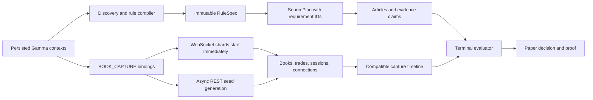
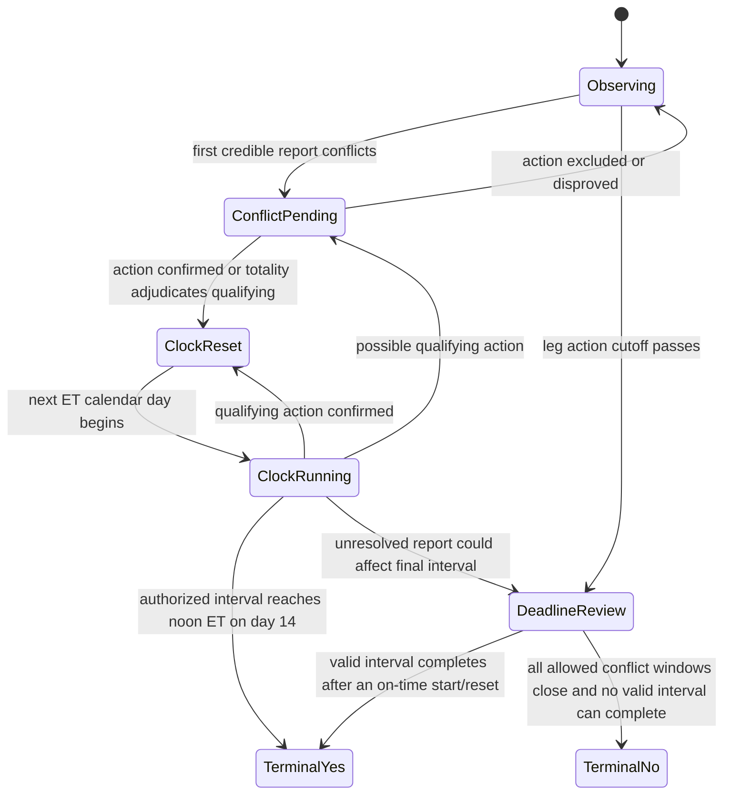

# Forward Capture and Priority Market Operating Plan

Snapshot date: 2026-08-10

## Outcome

Build a continuously recording, fail-loud market-data layer and use it to
develop thirteen Iran/geopolitics markets through deterministic rules, exact
source policies, replay, and paper-only forward validation. Recording must not
wait for discovery or semantic compilation. Semantic disagreements must never
be converted into trading authority.

The deployment remains paper-only. Moving any family to live execution is a
separate operator decision after replay, forward evidence, calibration, and
risk review.

## Non-Negotiable Invariants

1. `BOOK_CAPTURE` bindings are independent of RuleSpecs and SourcePlans.
2. A semantic query may inherit capture rows only when market ID, immutable
   context payload, and recorder policy all match.
3. Monitored contexts are always retained; open priority pins are next; volume
   fills only the remaining capacity. Terminal extras are excluded.
4. WebSockets start before REST seeding. Obsolete seed generations may neither
   block refresh/shutdown nor write through a replaced session.
5. Aggregators discover articles but never authorize a terminal action.
6. Source-policy, deadline, topology, predicate, or compiler disagreement fails
   closed.
7. Silence is never terminal evidence. A deadline alone never creates a
   terminal No unless the verbatim rule explicitly permits it.
8. Every execution path remains paper-only until an explicit, separately
   reviewed promotion changes that state.

## Verified Baseline

- Maintained config: `configs/geopolitics/discovery.yaml`.
- Fleet unit: `polybot-fleet.service`, paper-only, using the maintained config.
- Recorder config: enabled, shared service, all-context recording, 200-context
  cap, 70 GiB warning, 80 GiB hard pause.
- Host snapshot at 2026-08-10 09:35 UTC: 200 selected contexts, 5,484
  tokens, 28/28 connected shards, about 1,986 book events per minute; book
  rows continued increasing promptly without waiting for discovery.
- Recorder database snapshot: about 59.97 GiB, below the 70 GiB warning and
  80 GiB hard-pause thresholds.
- Unified baseline: Python suite, TypeScript suite, and TypeScript typecheck
  pass through `make test`.
- Reviewed resolution canary: next US-Iran talks, current RuleSpec and
  SourcePlan, now correctly `CLOSED`.
- Active paper canary: US strike on Cuba, current RuleSpec and SourcePlan,
  `PAPER_ELIGIBLE`; one cycle yielded zero executions and explicit ambiguous
  proofs. Its adversarial replay rejects artillery, interception, naval
  shelling, and territorial-sea cases, then permits the first qualifying
  Reuters report to create the sole paper entry with zero source-policy
  violations.
- Official-announcement paper canary: US blockade announcement, reviewed
  RuleSpec `25837ae13fa6dc7b684afa6b06397bdff0d59912dde97f6105be937542214545`,
  fresh SourcePlan, and `PAPER_ELIGIBLE`; one cycle produced 17 ambiguous
  per-leg proofs and zero executions. A deterministic replay now proves that
  partial exemptions, conditional previews, leaks, and unauthorized comments
  remain nonterminal, while the qualifying White House announcement produces
  the only paper entry with zero source-policy violations.

These are point-in-time observations. Fleet status and SQLite counts must be
refreshed before every rollout decision.

## Current Operating Assessment

| Area | State | Interpretation | Required action |
|---|---|---|---|
| Shared capture | Healthy and streaming | The original empty-recorder blocker is removed | Preserve compatibility and storage tests; do not couple capture to RuleSpec readiness again |
| REST seed | Asynchronous; 159/5,484 complete and 109 errors in the snapshot | Seed failures no longer delay WebSockets, but error causes need attribution | Classify errors by HTTP/status/exception, retry only transient classes, and expose per-class counts |
| Discovery | Running in the snapshot | Recorder startup is correctly independent of the long cycle | Keep startup-before-discovery ordering regression coverage |
| Fleet summary | Child snapshot stale from 2026-08-01 | Recorder health is current, but desired/running bot state is not trustworthy | Diagnose final fleet-sync publication after the current discovery cycle |
| Semantic assets | 3 current RuleSpecs and 3 current SourcePlans | Only blockade, Cuba, and the closed peace-talks canary are semantically bound | Continue per-market reviewed/consensus work; never infer readiness from capture |
| Execution | Paper-only; no live families | Safe operating posture | Keep `live_confirmation_families` empty throughout this roadmap |

The REST seed errors and stale fleet child snapshot are operational follow-ups,
not reasons to stop healthy WebSocket capture. They are reasons to keep status
fail-loud and to block any promotion that relies on the affected state.

## System Flow



## Source Lanes: Speed, Authority, and Measured Impact

Every source belongs to one or more lanes. The lanes are evaluated separately;
being fast does not make a source authoritative, and being authoritative does
not make its endpoint fast.

| Lane | Purpose | Examples | May create terminal evidence? |
|---|---|---|---|
| A0 — exact settlement authority | Satisfy a named rule requirement | White House, State, Defense/War, CENTCOM, named Iranian/Israeli authorities, IMF PortWatch | Yes, but only for the exact requirement IDs and predicates in the RuleSpec |
| A1 — independent credible confirmation | Establish consensus or the reporting branch of a rule | Reuters, AP, AFP and other separately owned publishers accepted by the SourcePlan | Only when the rule explicitly permits credible reporting and its exact quorum is met |
| A2 — fast actor/regional alert | Discover a likely event before slower authority pages update | IRNA, Mehr, Oman FM, Anadolu and comparable actor/regional feeds | No by default; promote only if the RuleSpec explicitly grants that organization a role |
| A3 — aggregator discovery | Find original articles and recover from feed gaps | Google News, Bing RSS and publisher mirrors | Never; resolve to the origin publisher and deduplicate there |

Source ingestion order is optimized for time-to-awareness. Evidence authority
is evaluated later from immutable source and requirement identities. A mirror
of Reuters is still one Reuters observation; six US government endpoints are
still one `government:united_states` independence group.

For the Cuba canary, the operator interpretation is deliberately low latency:
one qualifying report from one approved credible publisher is terminal, and a
qualifying Trump or U.S.-government claim is an alternative terminal path.
Additional publishers corroborate the event but are not required before the
paper decision. Syndicated copies remain the same origin observation; they do
not manufacture extra authority. Predicate and exclusion checks still run
before source policy, so an official report about an intercepted missile,
artillery, naval shelling, cyber activity, or a non-terrestrial impact cannot
terminal the market.

### How much a source moves a market

The system must answer this empirically in cents and executable dollars, not
with an analyst guess. For each source event, calculate:

- signed and absolute midpoint change at 250 ms, 1 s, 2 s, 5 s, and 10 s;
- spread and depth change at the same horizons;
- best executable entry after fee schedule, slippage, and decision latency;
- quote survival and available size when the decision completes;
- false-terminal loss and source-policy violation counts.

The configured minimum evidence for exploitation is 20 terminal observations,
100 human labels, 20 quote samples, 20 stressed-fill samples, and 5 resolved
paper trades. The 95% conservative lower bound on net edge must remain positive.
Until then, reported page moves and individual anecdotes are hypotheses only;
the source stays exploration or alert-only.

## Exact Resettable-Duration Design for the US-Iran Ceasefire Market

The current generic duration evaluator is not sufficient for this market. It
can compare a breach timestamp with a duration-claim timestamp, but an article
published later does not prove that the duration it describes began after the
latest breach. List order is also not a valid event ordering. The reviewed
candidate stays blocked until the following event-ledger design exists.

### Required immutable inputs

- market creation instant and each leg's exact `11:59 PM America/New_York`
  action cutoff;
- qualifying-action occurrence time, first credible report time, attribution,
  initiator, impact location, weapon class, and exclusion reason;
- conflict state, resolution time, and the rule's three-full-calendar-day ET
  adjudication deadline;
- a duration interval with explicit start and end instants, source requirement
  IDs, and coverage/authorization proof;
- the derived first ET calendar day after the latest confirmed qualifying
  action and the exact noon-ET completion instant on the fourteenth day.

### State machine



A strike after a completed valid interval cannot reverse terminal Yes. A strike
before completion resets the clock. A threat, authorization, interception,
surface-to-air strike, small-arms fire, ground incursion, cyber operation,
naval/artillery fire, minor listed munition, maritime-only impact, or debris
impact cannot reset it. Conflicting reports keep the state nonterminal until
the rule's adjudication window closes. Silence, list order, publication time,
or an opaque `DURATION_OBSERVED=14 days` claim cannot create terminal Yes.

### Acceptance fixtures

1. No qualifying action and a fully covered, authorized 14-day interval.
2. Qualifying action on day 13 resets the clock.
3. Earlier breach followed by a separately proven later 14-day interval.
4. A late-published article describing a pre-breach interval remains blocked.
5. Intercepted missile, debris, naval gunfire, and threat-only cases do not
   reset the clock.
6. Direct terrestrial impact, correct US attribution, and weapon class reset
   every eligible ladder leg independently.
7. Conflicting occurrence/attribution/timing enters the three-day ET state and
   never resolves from a single contradicted statement.
8. A period beginning by the leg cutoff may complete after it, exactly as the
   rule permits; a period beginning after the cutoff cannot satisfy that leg.

## Market Work Queue

| Priority | Market | Current state | Terminal sources | Required next work |
|---:|---|---|---|---|
| 1 | US announces end of Iranian blockade | `PAPER_ELIGIBLE`, reviewed spec/plan current; adversarial replay passed | White House, State, Defense/War, CENTCOM | Collect forward paper evidence and labeled real-source observations |
| 2 | US-Iran effective ceasefire | Rule compiler disagreement | US and Iranian government/military; credible reporting only where rules permit | Review 14-day reset state, qualifying strikes, conflict fallback, and exact ET deadline |
| 3 | US-Iran final nuclear deal | Rule compiler disagreement | US/Iran governments or authorized representatives | Review written-instrument predicate and per-leg rule deadlines |
| 4 | US military action against Cuba | `PAPER_ELIGIBLE`; single-source/exclusion replay passed | One approved credible publisher, Donald Trump, or US government | Repair/refresh fee schedules and book freshness, then collect forward paper evidence and labels |
| 5 | Hamas disarm by Dec 31 | Rule compiler disagreement | Hamas leadership; wide credible consensus only under the rule's alternative path | Implement safe nested/alternative quorum or keep fallback blocked |
| 6 | Location of next US-Iran talks | Invalid first compile | US/Iran official information plus credible consensus | Review 19-way exclusive topology and correct invalid fallback quorum |
| 7 | Iran successfully targets shipping | Rule compiler disagreement | Credible-reporting consensus | Review every daily outcome independently; prohibit cross-date inference |
| 8 | Iran charges Hormuz fees | Rule compiler disagreement | Iranian official announcement and independent reporting of collection | Add compound announcement-AND-collection predicate/evidence support |
| 9 | Israel-Iran ceasefire continues | Rule compiler disagreement | Israeli/Iranian official and military information plus credible reporting | Replay passed legs and dispute windows; resolve source-policy disagreement |
| 10 | Iran leader at end of 2026 | Invalid compile | Credible-reporting consensus on de facto authority | Review all active exclusive outcomes and bind terminal clause IDs |
| 11 | Iran military action against Gulf state | Rule compiler disagreement | Iran, affected Gulf government/military, credible consensus | Per-day resolution replay; selected date is already terminal-history work |
| 12 | Next US-Iran peace talks | `CLOSED`, reviewed spec/plan current | Named US or Iranian government | Use for terminal evidence/replay and source-policy regression, not entry |
| 13 | Bab el-Mandeb closure | Metadata/adapter blocked | IMF PortWatch | Repair exact per-leg deadline binding; build numeric series, revision cutoff, and missing-data adapter |

Priority is not authority. The queue controls engineering attention and bounded
compiler attempts only.

## Execution Board

Work is delivered in the following dependency order. A package may begin in
parallel only when it does not consume a not-yet-proven primitive from an
earlier package.

| Package | Markets / system | Main code surfaces | Required outputs | Exit gate |
|---:|---|---|---|---|
| 0 | Recorder operations | `polybot/rules/forward.py`, fleet status, service logs | REST seed error taxonomy; final fleet-sync freshness diagnosis; storage runway check | Streaming remains healthy, errors are attributable, and status never implies stale fleet children are current |
| 1 | Blockade and Cuba | evidence extraction, replay, generic paper runner | Real-source labels, compatible quote timelines, paper proofs; both adversarial replays now pass | Zero false terminals/policy bypasses and configured minimum forward samples begin accumulating |
| 2 | US-Iran duration and Israel-Iran ceasefire status | contracts, evidence claims, evaluators, replay | Action ledger, explicit duration intervals, ET/IRST calendar logic, conflict adjudication, shared strike-exclusion corpus | Every reset/status fixture passes per leg; compiler candidate repeats exactly or remains blocked |
| 3 | Final nuclear deal | compiler clauses, compound document evidence, source policy | Same-instrument/two-signature and formal-adoption representations; authorized representative identities | Partial drafts, framework announcements, one-sided signatures, and later repudiation replay correctly |
| 4 | Hamas disarm and talks location | structured source policy and exclusive topology | Official-OR-wide-consensus policy; 19-way exclusive binding including catch-alls | No flattening of alternative quorums; exactly one terminal location outcome can win |
| 5 | Hormuz fees | compound predicates and evidence joins | Iranian announcement branch AND independent collection branch, both before each leg cutoff | Neither announcement-only nor isolated vessel demand can terminal; both branches can |
| 6 | Shipping and Gulf-state daily markets | independent multi-outcome evaluator | Immutable per-date windows, target outcome enforcement, date-local proofs | Evidence for one date cannot affect another; every active leg has boundary fixtures |
| 7 | Iran leader | categorical authority evaluator | Active-outcome filtering and de facto-control indicators | Symbolic/formal-only claims stay ambiguous; one effective controller or No Head of State resolves exclusively |
| 8 | Bab el-Mandeb | Gamma deadline repair, IMF PortWatch adapter, numeric evaluator | Versioned raw series, 7-day average, revision ledger, publication cutoff, 14-day missing-data behavior | Fixture parity with PortWatch calculations and deterministic Yes/No under revisions/missing data |
| 9 | Closed peace talks | replay and source-policy regression only | Historical terminal corpus for official-government versus credible-consensus paths | Remains non-entry and continuously guards semantic/source regressions |

For each package, implementation follows the same vertical slice:

1. Freeze the current `MarketContext` and verbatim rule/clause hashes.
2. Add the minimum contract expressiveness without weakening older specs.
3. Build canonical source identities and exact requirement topology.
4. Add deterministic unit fixtures before importing a reviewed RuleSpec.
5. Repeat the candidate hash, import with a substantive review, and build a
   current SourcePlan.
6. Run adversarial replay, then a one-shot paper cycle, then continuous soak.
7. Join decisions to compatible capture rows and publish economics with sample
   counts and confidence bounds.
8. Keep the market blocked if any step fails; proceed to unrelated packages
   instead of granting an exception.

## Package-Level Verification Commands

Use the narrowest test while iterating, then the unified gate before every
commit intended for deployment:

```bash
TMPDIR=/tmp TEMP=/tmp .venv/bin/python -m pytest -q -s tests/test_rule_evidence.py
TMPDIR=/tmp TEMP=/tmp .venv/bin/python -m pytest -q -s tests/test_rule_replay.py
TMPDIR=/tmp TEMP=/tmp .venv/bin/python -m pytest -q -s tests/test_forward_recorder.py tests/test_fleet.py
TMPDIR=/tmp TEMP=/tmp make test
```

Market-specific reviewed imports must additionally run consensus reporting,
candidate preparation/repeat, deterministic preflight, replay, source-plan
freshness, and a generic paper-runner cycle. The exact generated hashes are
recorded in the review and operating log; they are never copied from a prior
rule version.

## Source Strategy

### Terminal authority

- Source-locked official markets: ingest the exact named government or
  organization endpoints. All endpoints for one government share one
  independence group.
- Credible-reporting markets: require the RuleSpec's exact policy and count
  independent publishers, not URLs, mirrors, or aggregators.
- Numeric-oracle markets: accept only the named dataset and its versioned
  calculation/revision rules.
- Compound markets: every required evidence branch must be satisfied; one
  article cannot substitute for an official announcement plus actual
  collection or behavior.

### Speed and discovery

Direct publisher feeds are the low-latency discovery layer. Google News and
Bing RSS are redundant discovery fallbacks. State-affiliated and regional
feeds may accelerate awareness but cannot authorize settlement unless the
RuleSpec explicitly names them. Official feeds take precedence for terminal
authority even when they are slower.

Every feed probe records HTTP status, body type, item count, and freshness.
HTTP-200 JSON is labeled `JSON`; XML with zero items remains dead; minified XML
must count every `<item>` or `<entry>` occurrence.

## Rule and Evaluator Roadmap

### R1 — Finish canonical semantics

- Prepare a reviewed candidate only from a stored normalized compiler pass.
- Bind the candidate to current context, rule hash, clause IDs, topology,
  instrument IDs, source requirement IDs, and exact semantic deadlines.
- Require a separately repeated candidate hash, reviewer identity, and
  substantive note at import.
- Never hand-merge two disagreeing passes without a reviewed candidate and
  deterministic validation.

### R2 — Add missing expressiveness

- Nested source logic: one official source OR a quorum of independent credible
  publishers.
- Compound predicates: official announcement AND observed implementation.
- Resettable durations: a qualifying event restarts an exact continuous window.
- Numeric time series: named dataset, moving average, revisions, publication
  cutoff, and missing-data terminal behavior.
- Independent daily bins: separate window and evidence state for every date.

### R3 — Prove terminal behavior

For every market, fixtures cover terminal Yes, terminal No, ambiguous,
conflicting evidence, insufficient sources, wrong requirement IDs, wrong
outcome/date, deadline boundary, stale context, and stale policy. Exact source
requirements must be present on claims; unmatched publisher data remains raw
context only.

## Measuring Which Feed Moves a Market, and by How Much

Do not infer impact from reputation. Measure it from capture data:

1. Stamp the source publication/first-seen time and preserve source identity,
   origin organization, byline, requirement IDs, and extraction completion.
2. Join only to a compatible capture binding.
3. Record midpoint, best bid/ask, spread, and depth immediately before the
   source timestamp and at 250 ms, 1 s, 2 s, 5 s, and 10 s afterward.
4. Compute signed midpoint movement, absolute movement, spread change, depth
   consumed, executable edge after fees/slippage, and whether the quote was
   still fillable at decision completion.
5. Deduplicate syndicated copies by origin organization.
6. Report per source/market/family: observation count, p50/p95 latency, p50/p95
   move, false-terminal rate, and stressed fill edge.

No source receives exploitation priority until it has at least the configured
minimum forward observations and a positive conservative lower bound after
processing cost, slippage, and false-terminal loss. Until then it stays in
bounded exploration or alert-only mode.

## Delivery Phases and Exit Gates

### Phase A — Recorder and status hardening

Exit when startup status is always explicit, persisted contexts bootstrap
capture before discovery, WebSockets precede cancellable REST seeds, terminal
extras are excluded, capture metrics are visible in `make status`, feed-probe
regressions pass, and the 200-context cap/superset invariant are tested.

### Phase B — Current active canaries

Exit when Cuba has replay fixtures plus forward paper observations and at least
one official-announcement market (prefer blockade) has a reviewed RuleSpec,
fresh SourcePlan, and safe ambiguous/terminal fixtures. Disagreement remains a
valid result only if the market stays explicitly non-executable.

### Phase C — Missing evaluator primitives

Implement and test nested quorum, compound evidence, resettable duration,
independent daily bins, and IMF numeric-oracle support. Each primitive is
promoted independently; no cohort-wide waiver exists.

### Phase D — Paper soak and economics

For each eligible family, run continuous paper evaluation while recording
claims, decisions, proofs, quote timelines, missed/available fills, and source
latency. Require zero policy bypasses, zero cross-outcome evidence leaks, and
enough samples for the configured conservative economics report.

### Phase E — Deployment audit

1. Run `TMPDIR=/tmp TEMP=/tmp make test`.
2. Verify config values and obsolete config absence or diff.
3. Probe candidate feeds and record verdict changes.
4. Confirm `.env` mode, paper-only unit command, disk headroom, and database
   backup/recovery procedure.
5. Reload and restart `polybot-fleet.service`.
6. Before discovery finishes, verify enabled `forward_books`, increasing book
   rows, recorder/WebSocket logs, at most 200 contexts, sane shard count, and
   no storage pause.
7. After discovery, verify source-plan freshness, fleet child state, and paper
   decisions for eligible canaries.

### Phase F — Separate live-promotion decision

Live remains out of scope until an operator reviews replay and forward metrics,
sets family-specific risk limits, verifies calibration and false-terminal
loss, approves exact source adapters, and explicitly changes the live-family
allowlist. A successful paper soak does not automatically promote anything.

## Definition of Done

- Recorder begins useful capture immediately and fails loudly when disabled,
  stale, full, disconnected, or unavailable.
- Every priority context is visible with an explicit semantic state and reason.
- Every executable canary has current RuleSpec and SourcePlan hashes.
- Terminal decisions prove exact outcome, clause, source requirement, policy,
  and compatible quote timeline.
- Obsolete seed work cannot write; terminal extras cannot consume capacity;
  unrelated raw rows cannot be claimed by semantics.
- The full unified suite passes and the host restarts into the maintained,
  paper-only configuration with a clean tracked worktree.
