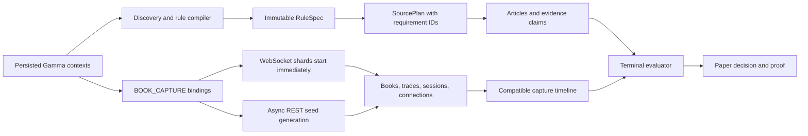

# Forward Capture and Priority Market Operating Plan

Snapshot date: 2026-08-10

## Outcome

Build a continuously recording, fail-loud market-data layer and use it to
develop thirteen Iran/geopolitics markets through deterministic rules, exact
source policies, replay, and paper-only forward validation. Recording must not
wait for discovery or semantic compilation. Semantic disagreements must never
be converted into trading authority.

The deployment remains paper-only. Moving any family to live execution is a
separate operator decision after replay, forward evidence, calibration, and
risk review.

## Non-Negotiable Invariants

1. `BOOK_CAPTURE` bindings are independent of RuleSpecs and SourcePlans.
2. A semantic query may inherit capture rows only when market ID, immutable
   context payload, and recorder policy all match.
3. Monitored contexts are always retained; open priority pins are next; volume
   fills only the remaining capacity. Terminal extras are excluded.
4. WebSockets start before REST seeding. Obsolete seed generations may neither
   block refresh/shutdown nor write through a replaced session.
5. Aggregators discover articles but never authorize a terminal action.
6. Source-policy, deadline, topology, predicate, or compiler disagreement fails
   closed.
7. Silence is never terminal evidence. A deadline alone never creates a
   terminal No unless the verbatim rule explicitly permits it.
8. Every execution path remains paper-only until an explicit, separately
   reviewed promotion changes that state.

## Verified Baseline

- Maintained config: `configs/geopolitics/discovery.yaml`.
- Fleet unit: `polybot-fleet.service`, paper-only, using the maintained config.
- Recorder config: enabled, shared service, all-context recording, 200-context
  cap, 70 GiB warning, 80 GiB hard pause.
- Host snapshot after restart: 200 selected contexts, 5,484 tokens, 28 shards;
  book rows continued increasing promptly without waiting for discovery.
- Recorder database snapshot: about 59.65 GiB, below the warning threshold.
- Unified baseline: Python suite, TypeScript suite, and TypeScript typecheck
  pass through `make test`.
- Reviewed resolution canary: next US-Iran talks, current RuleSpec and
  SourcePlan, now correctly `CLOSED`.
- Active paper canary: US strike on Cuba, current RuleSpec and SourcePlan,
  `PAPER_ELIGIBLE`; one cycle yielded zero executions and explicit ambiguous
  proofs.
- Official-announcement paper canary: US blockade announcement, reviewed
  RuleSpec `25837ae13fa6dc7b684afa6b06397bdff0d59912dde97f6105be937542214545`,
  fresh SourcePlan, and `PAPER_ELIGIBLE`; one cycle produced 17 ambiguous
  per-leg proofs and zero executions.

These are point-in-time observations. Fleet status and SQLite counts must be
refreshed before every rollout decision.

## System Flow

## Market Work Queue

| Priority | Market | Current state | Terminal sources | Required next work |
|---:|---|---|---|---|
| 1 | US announces end of Iranian blockade | `PAPER_ELIGIBLE`, reviewed spec/plan current | White House, State, Defense/War, CENTCOM | Add official/partial/conditional/leaked replay fixtures; collect forward paper evidence |
| 2 | US-Iran effective ceasefire | Rule compiler disagreement | US and Iranian government/military; credible reporting only where rules permit | Review 14-day reset state, qualifying strikes, conflict fallback, and exact ET deadline |
| 3 | US-Iran final nuclear deal | Rule compiler disagreement | US/Iran governments or authorized representatives | Review written-instrument predicate and per-leg rule deadlines |
| 4 | US military action against Cuba | `PAPER_ELIGIBLE` | Credible-reporting consensus, Donald Trump, or US government | Add replay fixtures for claimed and independently reported strikes; collect forward paper evidence |
| 5 | Hamas disarm by Dec 31 | Rule compiler disagreement | Hamas leadership; wide credible consensus only under the rule's alternative path | Implement safe nested/alternative quorum or keep fallback blocked |
| 6 | Location of next US-Iran talks | Invalid first compile | US/Iran official information plus credible consensus | Review 19-way exclusive topology and correct invalid fallback quorum |
| 7 | Iran successfully targets shipping | Rule compiler disagreement | Credible-reporting consensus | Review every daily outcome independently; prohibit cross-date inference |
| 8 | Iran charges Hormuz fees | Rule compiler disagreement | Iranian official announcement and independent reporting of collection | Add compound announcement-AND-collection predicate/evidence support |
| 9 | Israel-Iran ceasefire continues | Rule compiler disagreement | Israeli/Iranian official and military information plus credible reporting | Replay passed legs and dispute windows; resolve source-policy disagreement |
| 10 | Iran leader at end of 2026 | Invalid compile | Credible-reporting consensus on de facto authority | Review all active exclusive outcomes and bind terminal clause IDs |
| 11 | Iran military action against Gulf state | Rule compiler disagreement | Iran, affected Gulf government/military, credible consensus | Per-day resolution replay; selected date is already terminal-history work |
| 12 | Next US-Iran peace talks | `CLOSED`, reviewed spec/plan current | Named US or Iranian government | Use for terminal evidence/replay and source-policy regression, not entry |
| 13 | Bab el-Mandeb closure | Metadata/adapter blocked | IMF PortWatch | Repair exact per-leg deadline binding; build numeric series, revision cutoff, and missing-data adapter |

Priority is not authority. The queue controls engineering attention and bounded
compiler attempts only.

## Source Strategy

### Terminal authority

- Source-locked official markets: ingest the exact named government or
  organization endpoints. All endpoints for one government share one
  independence group.
- Credible-reporting markets: require the RuleSpec's exact policy and count
  independent publishers, not URLs, mirrors, or aggregators.
- Numeric-oracle markets: accept only the named dataset and its versioned
  calculation/revision rules.
- Compound markets: every required evidence branch must be satisfied; one
  article cannot substitute for an official announcement plus actual
  collection or behavior.

### Speed and discovery

Direct publisher feeds are the low-latency discovery layer. Google News and
Bing RSS are redundant discovery fallbacks. State-affiliated and regional
feeds may accelerate awareness but cannot authorize settlement unless the
RuleSpec explicitly names them. Official feeds take precedence for terminal
authority even when they are slower.

Every feed probe records HTTP status, body type, item count, and freshness.
HTTP-200 JSON is labeled `JSON`; XML with zero items remains dead; minified XML
must count every `<item>` or `<entry>` occurrence.

## Rule and Evaluator Roadmap

### R1 — Finish canonical semantics

- Prepare a reviewed candidate only from a stored normalized compiler pass.
- Bind the candidate to current context, rule hash, clause IDs, topology,
  instrument IDs, source requirement IDs, and exact semantic deadlines.
- Require a separately repeated candidate hash, reviewer identity, and
  substantive note at import.
- Never hand-merge two disagreeing passes without a reviewed candidate and
  deterministic validation.

### R2 — Add missing expressiveness

- Nested source logic: one official source OR a quorum of independent credible
  publishers.
- Compound predicates: official announcement AND observed implementation.
- Resettable durations: a qualifying event restarts an exact continuous window.
- Numeric time series: named dataset, moving average, revisions, publication
  cutoff, and missing-data terminal behavior.
- Independent daily bins: separate window and evidence state for every date.

### R3 — Prove terminal behavior

For every market, fixtures cover terminal Yes, terminal No, ambiguous,
conflicting evidence, insufficient sources, wrong requirement IDs, wrong
outcome/date, deadline boundary, stale context, and stale policy. Exact source
requirements must be present on claims; unmatched publisher data remains raw
context only.

## Measuring Which Feed Moves a Market, and by How Much

Do not infer impact from reputation. Measure it from capture data:

1. Stamp the source publication/first-seen time and preserve source identity,
   origin organization, byline, requirement IDs, and extraction completion.
2. Join only to a compatible capture binding.
3. Record midpoint, best bid/ask, spread, and depth immediately before the
   source timestamp and at 250 ms, 1 s, 2 s, 5 s, and 10 s afterward.
4. Compute signed midpoint movement, absolute movement, spread change, depth
   consumed, executable edge after fees/slippage, and whether the quote was
   still fillable at decision completion.
5. Deduplicate syndicated copies by origin organization.
6. Report per source/market/family: observation count, p50/p95 latency, p50/p95
   move, false-terminal rate, and stressed fill edge.

No source receives exploitation priority until it has at least the configured
minimum forward observations and a positive conservative lower bound after
processing cost, slippage, and false-terminal loss. Until then it stays in
bounded exploration or alert-only mode.

## Delivery Phases and Exit Gates

### Phase A — Recorder and status hardening

Exit when startup status is always explicit, persisted contexts bootstrap
capture before discovery, WebSockets precede cancellable REST seeds, terminal
extras are excluded, capture metrics are visible in `make status`, feed-probe
regressions pass, and the 200-context cap/superset invariant are tested.

### Phase B — Current active canaries

Exit when Cuba has replay fixtures plus forward paper observations and at least
one official-announcement market (prefer blockade) has a reviewed RuleSpec,
fresh SourcePlan, and safe ambiguous/terminal fixtures. Disagreement remains a
valid result only if the market stays explicitly non-executable.

### Phase C — Missing evaluator primitives

Implement and test nested quorum, compound evidence, resettable duration,
independent daily bins, and IMF numeric-oracle support. Each primitive is
promoted independently; no cohort-wide waiver exists.

### Phase D — Paper soak and economics

For each eligible family, run continuous paper evaluation while recording
claims, decisions, proofs, quote timelines, missed/available fills, and source
latency. Require zero policy bypasses, zero cross-outcome evidence leaks, and
enough samples for the configured conservative economics report.

### Phase E — Deployment audit

1. Run `TMPDIR=/tmp TEMP=/tmp make test`.
2. Verify config values and obsolete config absence or diff.
3. Probe candidate feeds and record verdict changes.
4. Confirm `.env` mode, paper-only unit command, disk headroom, and database
   backup/recovery procedure.
5. Reload and restart `polybot-fleet.service`.
6. Before discovery finishes, verify enabled `forward_books`, increasing book
   rows, recorder/WebSocket logs, at most 200 contexts, sane shard count, and
   no storage pause.
7. After discovery, verify source-plan freshness, fleet child state, and paper
   decisions for eligible canaries.

### Phase F — Separate live-promotion decision

Live remains out of scope until an operator reviews replay and forward metrics,
sets family-specific risk limits, verifies calibration and false-terminal
loss, approves exact source adapters, and explicitly changes the live-family
allowlist. A successful paper soak does not automatically promote anything.

## Definition of Done

- Recorder begins useful capture immediately and fails loudly when disabled,
  stale, full, disconnected, or unavailable.
- Every priority context is visible with an explicit semantic state and reason.
- Every executable canary has current RuleSpec and SourcePlan hashes.
- Terminal decisions prove exact outcome, clause, source requirement, policy,
  and compatible quote timeline.
- Obsolete seed work cannot write; terminal extras cannot consume capacity;
  unrelated raw rows cannot be claimed by semantics.
- The full unified suite passes and the host restarts into the maintained,
  paper-only configuration with a clean tracked worktree.
